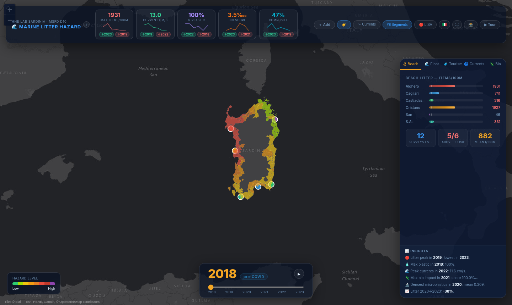

# Marine Litter Hazard Assessment — Sardinia

**Human Health and Environment · Data Science Laboratory · Politecnico di Milano · 2026**
Daniele Uras · Filippo Saccomano · Tommaso Nesa · Tommaso Del Vecchio · Viola Guazzoni

A multi-compartment spatial hazard index for marine litter along the Sardinian coast, built from six years (2018–2023) of ISPRA monitoring data under the EU Marine Strategy Framework Directive (MSFD, Descriptor 10), and explored through an interactive map dashboard.



**[Live dashboard](https://daniele22-u.github.io/hhe-labsardinia/)** · [Report source](report/report.tex) · [Analysis notebook](notebooks/00_analysis.ipynb)

---

## What it does

- **Cleans and harmonises** the ISPRA survey modules: beach litter, floating litter, microplastics, seafloor sediments, ingestion and entanglement. Category codes are mapped across the pre- and post-2022 MSFD lists.
- **Builds a spatial hazard index** on a coastal grid that combines beach, plastic, current and biological signals with tunable weights, then aggregates it to the 126 coastal municipalities.
- **Tests spatial structure** with Global Moran's I and LISA hotspot analysis, and looks at drivers such as tourism, sea currents and the 2020 COVID drop.
- **Serves everything through one data contract**: the pipeline writes a single `dashboard_data.json` that feeds the figures, the dashboard and the report.

### Main findings

- A persistent **west-coast hazard corridor** (Alghero–Oristano); the east coast is consistently low.
- **Significant spatial clustering** in every year (Global Moran's I ≈ 0.95, p < 0.001), with a coherent LISA high-high hotspot.
- **COVID natural experiment**: beach litter fell by about 68% in 2020 with tourism while currents stayed constant, but it did not return to pre-2020 levels (legacy effect).

## Dashboard

React + Leaflet + Recharts. Features include:
- a year slider (2018–2023) with animation;
- compartment tabs: beach, floating, tourism, currents, biological;
- current arrows, coastal segments and the LISA overlay;
- adjustable compartment weights, a guided tour, an IT/EN switch and PNG export.

```bash
cd dashboard-react
npm install
npm run dev        # http://localhost:5173
```

Every push to `main` that touches `dashboard-react/` rebuilds the dashboard and publishes it to GitHub Pages ([workflow](.github/workflows/deploy-dashboard.yml)).

## Repository structure

```
notebooks/
  00_analysis.ipynb        full pipeline: cleaning → EDA → spatial hazard index
  01_data_cleaning.ipynb   step-by-step versions of the same pipeline
  02_eda.ipynb
  03_spatial_hazard.ipynb
data/
  processed/               cleaned CSV / JSON outputs
  figures/                 static figures (PNG)
  *.html                   standalone Folium maps
  dashboard_data.json      aggregated data consumed by the dashboard
dashboard-react/           interactive dashboard (React + Vite)
report/report.tex          scientific report (LaTeX source)
docs/                      README assets
_archive/                  superseded scripts kept for traceability
```

## Reproducing the analysis

The raw ISPRA / CNR-IAS Excel files are **not included** (folder `Labenv/`, git-ignored). Place them in `Labenv/` at the repository root, then run:

```bash
pip install pandas numpy matplotlib seaborn geopandas folium scipy shapely geodatasets xlrd openpyxl
jupyter lab notebooks/00_analysis.ipynb
```

The processed outputs in `data/` are versioned, so the dashboard runs without the raw data.

## Data sources

| Module | Content | Years |
|--------|---------|-------|
| Modulo 4 | Beach litter surveys (MSFD JRC protocol) | 2018–2023 |
| Modulo 2bis | Floating litter transects | 2018–2023 |
| Modulo 2 | Microplastics (net trawls) | 2021–2023 |
| Modulo D8 | Seafloor sediment microplastics | 2021–2023 |
| Standard D10 RIF-ING | Ingestion (seabirds, turtles) | 2018–2023 |
| Standard D10 RIF-ENT | Entanglement | 2018–2023 |

Basemap tiles © Esri (Esri, HERE, Garmin, © OpenStreetMap contributors).
